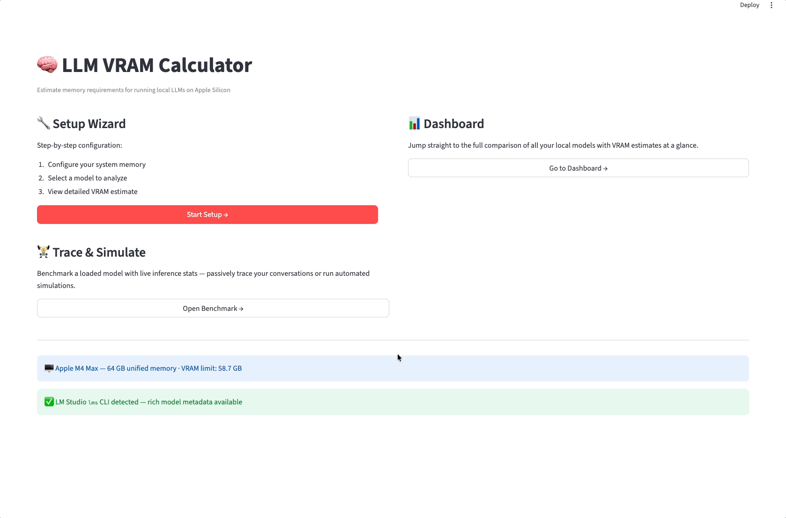
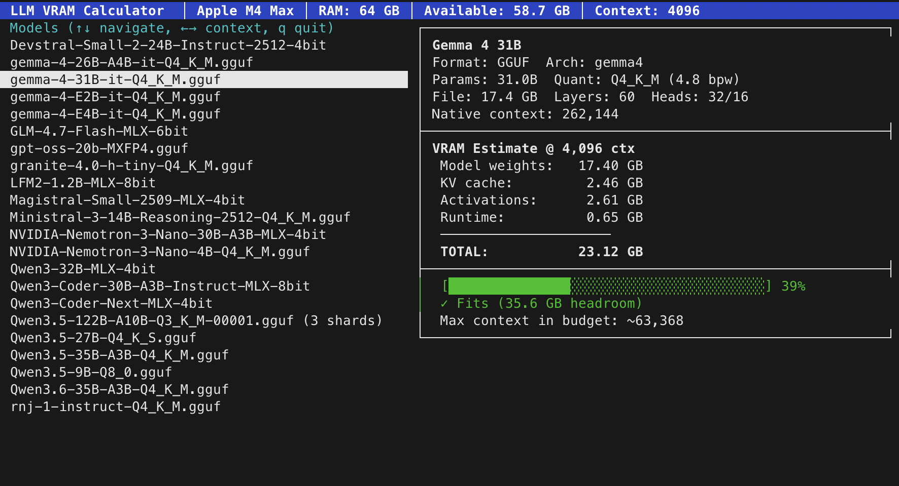

# Mac with LM Studio LLM VRAM Calculator

Estimate memory requirements for running local LLMs on Apple Silicon, with integrated inference benchmarking via LM Studio.




## Features

**VRAM Estimation**
- MoE-aware estimates (active vs total parameters for Mixture-of-Experts models)
- KV cache growth modeling with GQA/MQA support
- RoPE scaling detection with context quality warnings
- Context length sweet-spot finder (max context within your memory budget)
- Quantization variant comparison across available quants
- Runtime config comparison (estimated vs actual loaded config)
- Auto-detection of system RAM and manual `iogpu.wired_limit_mb` VRAM allocation

**Inference Benchmarking**
- Single-model simulation with configurable multi-turn conversations
- Multi-model comparison with automatic load/unload between runs
- Passive tracing of live conversations in LM Studio
- Per-round statistics: tok/s, TTFT, generation time, token counts, VRAM growth
- Topic presets (Q&A, Creative Writing, Coding, Reasoning) or custom prompts

**Terminal UI (TUI)**
- Curses-based interface — no browser required
- Split-pane layout: scrollable model list + detailed VRAM breakdown
- Interactive context length adjustment (←/→ to halve/double)
- Color-coded memory fit indicator with headroom display
- Max context sweet-spot finder per model

**Model Support**
- GGUF models (direct metadata parsing including MoE, RoPE, FFN fields)
- MLX models (HuggingFace config.json parsing)
- LM Studio `lms` CLI integration for rich model catalog
- Split/sharded GGUF file handling

## Prerequisites

- Python 3.10+
- macOS with Apple Silicon (unified memory architecture)
- [LM Studio](https://lmstudio.ai/) installed (provides `lms` CLI and local server)

The VRAM estimation features work with just the `lms` CLI or direct file scanning. The benchmarking features require LM Studio's server running on `localhost:1234`.

## Quickstart

```bash
git clone https://github.com/maciejjedrzejczyk/mac-llm-vram-calc && cd vram-calculator
./run.sh
```

Or manually:

```bash
python3 -m venv .venv
source .venv/bin/activate
pip install -r requirements.txt
streamlit run app.py
```

Opens at [http://localhost:8501](http://localhost:8501).

### Terminal UI

For a lightweight terminal-only experience (no browser needed):

```bash
python3 tui.py
```

Use ↑/↓ to browse models, ←/→ to adjust context length, and `q` to quit.

### Docker

```bash
./docker-run.sh      # build and start
./docker-cleanup.sh  # stop and remove
```

Requires LM Studio running on the host. The container mounts `~/.lmstudio` for model scanning and reaches the LM Studio server via `host.docker.internal`.

## Project Structure

| File | Purpose |
|---|---|
| `app.py` | Streamlit UI — multi-page wizard, dashboard, benchmark |
| `tui.py` | Curses-based terminal UI — model list, VRAM breakdown, fit indicator |
| `benchmark.py` | Inference benchmarking — simulate, trace, model load/unload |
| `gguf_scanner.py` | GGUF/MLX model scanning and metadata parsing |
| `vram_calc.py` | VRAM estimation engine |
| `lms_cli.py` | LM Studio CLI and REST API integration |
| `lmstudio_config.py` | Per-model config reader (context, KV cache) |
| `system_info.py` | macOS system memory auto-detection |

## License

MIT
